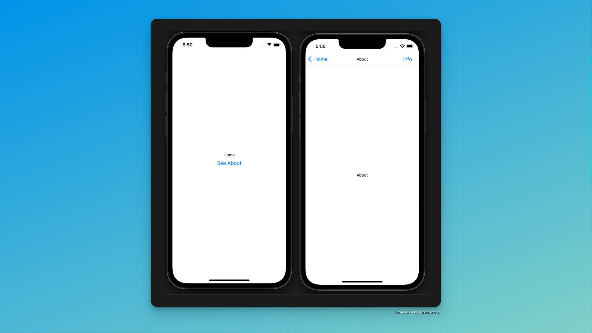

# 🚀 React Native Starter

<p>A simple React Native Starter with Expo, Typescript, Prettier and Navigation</p>



## 💻 Installation

Install Expo cli

```sh
npm install --global expo-cli
```

Install React Native cli

```sh
npm install -g react-native-cli
```

Cloner the repo

```sh
git clone git@github.com:rkueny/react-native-expo-typescript-starter.git
```

Move on directory

```sh
cd react-native-expo-typescript-starter
```

Install dependencies

```sh
yarn
```

Run project on iOs

```sh
yarn ios
```

Run project on Android

```sh
yarn android
```

## Author


[@sorens.eth](https://twitter.com/sorenseth) web developper and web3 enthusiast.
